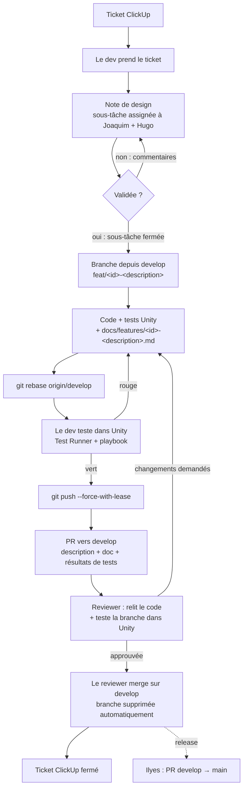

# Workflow de dev

Nouveau ? Commence par [`docs/demarrer.md`](./demarrer.md).

Du ticket ClickUp au merge sur `develop`. Commandes git détaillées :
[`docs/git-cheatsheet.md`](./git-cheatsheet.md). Tests :
[`docs/playbook-tests.md`](./playbook-tests.md).

## Rôles

| Rôle | Qui | Fait quoi |
|---|---|---|
| Owners | Joaquim, Hugo | Valident les notes de design |
| Lead dev | Ilyes | Seul à ouvrir et merger les PR `develop` → `main` |
| Dev | toute l'équipe | Prend un ticket, code, teste, ouvre la PR |
| Reviewer | un autre dev | Relit, **teste dans Unity**, approuve, merge |

## Schéma



## Étapes

### 1. Ticket et note de design

Le dev prend le ticket et crée une **sous-tâche de validation** assignée à
Joaquim et Hugo. La note de design est dans cette sous-tâche :

- **Quoi** : ce que la feature fait, vu par le joueur
- **Pourquoi** : le ticket
- **Comment** : scènes, prefabs, scripts, données, assets
- **Hors périmètre**
- **Risques et questions ouvertes**
- **Vérification** : tests automatisés et manuels prévus

Tant que la sous-tâche n'est pas fermée par Joaquim ou Hugo, **on ne code
pas**. Un fix, un refactor ou un chore n'a pas besoin de note.

### 2. Branche

Toujours depuis `develop` à jour. Nom : `type/<id-clickup>-<description>`,
en anglais ou en français sans accent.

`feat` · `fix` · `refactor` · `test` · `docs` · `chore`

### 3. Code, tests et doc

- Tests automatisés dans `Assets/Scripts/Tests/` (EditMode / PlayMode).
- Doc de la feature dans `docs/features/` — voir
  [`docs/features/README.md`](./features/README.md). **Avant de coder**, lire
  les docs existantes de la feature qu'on touche.
- Commits : `type(scope): description` en anglais.

### 4. Rebase et test avant push

```bash
git fetch origin
git rebase origin/develop
```

Puis dans Unity : tronc commun du playbook + tests manuels de la doc. Tout
doit être vert **après** le rebase — c'est le code qui sera mergé.

### 5. Push et PR

`git push --force-with-lease` (nécessaire après un rebase, uniquement sur sa
propre branche). PR vers **`develop`**, template rempli : lien ClickUp, lien
vers la doc, résultats de tests, ce qui n'a pas été vérifié.

### 6. Review

Le reviewer :

1. relit le diff (code, scènes, prefabs, `.meta`) ;
2. récupère la branche et **la teste dans Unity** : tronc commun + tests
   manuels de la doc — le code est écrit par IA, la relecture seule ne suffit
   pas ;
3. approuve, ou demande des changements.

Si le dev re-push après l'approbation, l'approbation saute : le reviewer
re-teste.

### 7. Merge

Le reviewer qui approuve merge (**merge commit**) sur `develop`. GitHub
supprime la branche distante. Le dev nettoie sa copie locale (voir la cheat
sheet) et ferme le ticket.

### `main`

Seul Ilyes ouvre et merge les PR `develop` → `main`, après la régression
complète du playbook.

## Pourquoi rebase + `--force-with-lease`

Le rebase replace les commits de la branche après le dernier `develop` :
historique linéaire, et on teste exactement ce qui sera mergé. Il réécrit les
commits, donc le push suivant doit forcer. `--force-with-lease` refuse
d'écraser la branche distante si quelqu'un d'autre y a poussé depuis ton
dernier `fetch` ; `--force` écrase sans regarder.

Règles :

- uniquement sur **sa propre** branche de feature ;
- jamais sur `develop` ni `main` (GitHub le bloque) ;
- si deux devs travaillent sur la même branche : `git merge origin/develop` au
  lieu de rebase, pour ne jamais réécrire le travail de l'autre.

## Labels

Les labels trient les PR. Presque tous se posent tout seuls
(`.github/workflows/labels.yml`) ; la liste est dans `scripts/setup-labels.sh`.

| Famille | Labels | Posé par |
|---|---|---|
| Type | `feat` `fix` `art` `docs` `refactor` `test` `chore` `ci` `net` `perf` `build` | le workflow, d'après le préfixe du titre de la PR |
| Zone à risque | `unity: scène` · `unity: prefab` · `unity: config` · `process` | le workflow, d'après les fichiers modifiés |
| Statut | `PR empilée` | le workflow, quand la PR ne vise ni `develop` ni `main` |
| Statut | `bloqué` | **à la main**, quand la PR attend autre chose |

Le reviewer regarde les labels de zone en premier : une scène, un prefab ou
une config Unity modifiés demandent un diff relu de près.

Travail en cours : ouvrir la PR en **brouillon** (*Draft*) plutôt qu'un label.
GitHub empêche de merger un brouillon.

## Réglages GitHub (avec GitHub Education)

À activer par un admin une fois l'organisation passée sur le plan Team :

- [x] **Labels** : créés par `scripts/setup-labels.sh` (déjà lancé). Pour changer la liste : modifier le script dans une PR, puis le relancer **sans** `--prune`
- [ ] **Branche par défaut** : `develop` (les nouvelles PR la visent d'office)
- [ ] **Automatically delete head branches**
- [ ] **Merge button** : merge commits uniquement (décocher squash et rebase)
- [ ] **Ruleset `develop`** :
  - require a pull request, **1 approval**
  - dismiss stale approvals when new commits are pushed
  - require conversation resolution
  - require status checks : jobs du workflow *Conventions*
  - block force pushes, restrict deletions
- [ ] **Ruleset `main`** :
  - require a pull request, 1 approval
  - restrict updates, avec **Ilyes seul** dans la bypass list
  - block force pushes, restrict deletions
  - require status checks : job *PR to main comes from develop*
